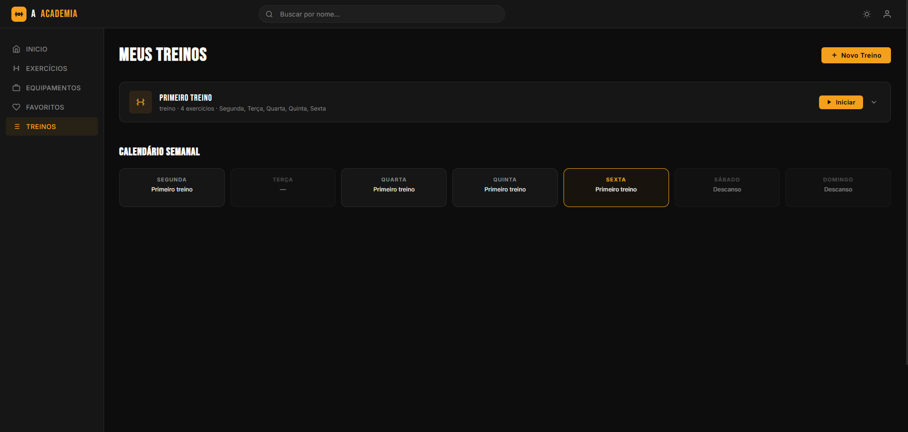
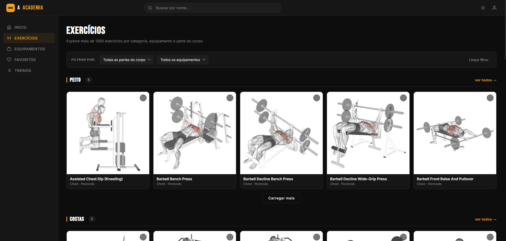
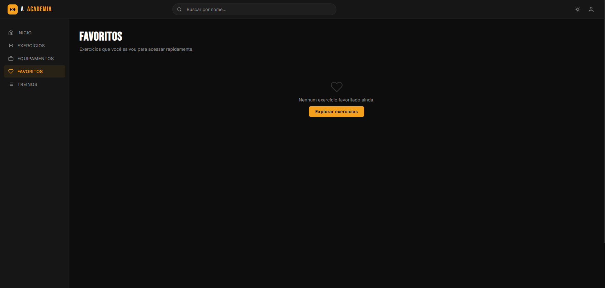
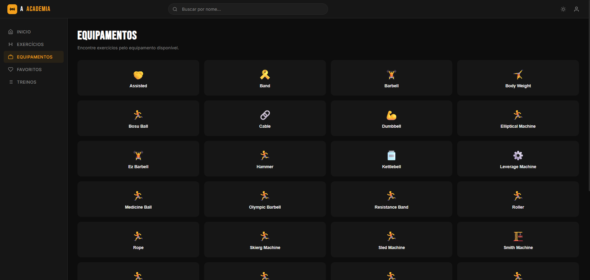

# 🏋️ A Academia

Aplicação web para gerenciamento de treinos, consulta de exercícios e acompanhamento da evolução física.


---

## 📖 Sobre

**A Academia** é uma aplicação desenvolvida em **HTML, CSS e JavaScript** que auxilia praticantes de musculação na organização dos seus treinos.

A aplicação permite criar treinos personalizados, pesquisar exercícios através da ExerciseDB, favoritar exercícios, organizar uma rotina semanal utilizando um calendário e acompanhar o histórico de cada treino realizado.

Todo o armazenamento é feito utilizando **LocalStorage**, permitindo que os dados permaneçam salvos mesmo após fechar o navegador.

---

# 📸 Demonstração

> Adicione suas capturas de tela na pasta `docs/images`.

|           Home            |           Treinos            |
| :-----------------------: | :--------------------------: |
|  |  |

|           Exercícios            |           Favoritos            |
| :-----------------------------: | :----------------------------: |
|  |  |

|           Equipamentos            |
| :-------------------------------: |
|  |

---

# ✨ Funcionalidades

- ✅ Cadastro de treinos personalizados
- ✅ Adição e remoção de exercícios
- ✅ Pesquisa de exercícios
- ✅ Exercícios favoritos
- ✅ Calendário semanal
- ✅ Cronômetro durante o treino
- ✅ Histórico de treinos
- ✅ Persistência de dados com LocalStorage
- ✅ Interface responsiva

---

# 🛠️ Tecnologias

- HTML5
- CSS3
- JavaScript (ES Modules)
- LocalStorage
- ExerciseDB API

---

# 🏗️ Arquitetura

```text
                    Usuário
                       │
                       ▼
               Interface (HTML/CSS)
                       │
                       ▼
               JavaScript (ES Modules)
        ┌──────────────┼──────────────┐
        │              │              │
   Components      Search         Storage
        │              │              │
        ├──────────────┘              │
        │                             │
        ▼                             ▼
 ExerciseDB API                 LocalStorage
```

---

# 📂 Estrutura do Projeto

```text
academia/
│
├── assets/
│
├── css/
│   ├── exercicios/
│   ├── favoritos/
│   ├── inicio/
│   ├── treinos/
│   └── global.css
│
├── docs/
│   └── images/
│
├── js/
│   ├── api.js
│   ├── components.js
│   ├── constants.js
│   ├── weeklyCalendar.js
│   ├── search.js
│   ├── storage.js
│   ├── inicio.js
│   ├── exercicios.js
│   ├── treinos.js
│   ├── favoritos.js
│   └── equipamentos.js
│
├── index.html
├── exercicios.html
├── favoritos.html
├── treinos.html
└── equipamentos.html
```

---

# 📄 Páginas

| Página           | Descrição                                                           |
| ---------------- | ------------------------------------------------------------------- |
| **Início**       | Dashboard principal com treinos, calendário, destaques e histórico. |
| **Exercícios**   | Pesquisa completa de exercícios disponíveis na API.                 |
| **Treinos**      | Criação, edição e gerenciamento dos treinos.                        |
| **Favoritos**    | Lista de exercícios salvos pelo usuário.                            |
| **Equipamentos** | Consulta de exercícios por equipamento.                             |

---

# 🧩 Módulos

### `api.js`

Responsável pela comunicação com a ExerciseDB.

---

### `storage.js`

Centraliza toda a persistência da aplicação utilizando o LocalStorage.

Gerencia:

- Treinos
- Favoritos
- Histórico
- Calendário semanal

---

### `components.js`

Responsável pelos componentes reutilizáveis da interface:

- Header
- Sidebar
- Footer
- Cards
- Toasts
- Modais

---

### `search.js`

Sistema responsável pela pesquisa global de exercícios.

---

### `weeklyCalendar.js`

Renderiza o calendário semanal reutilizado entre as páginas.

---

### `constants.js`

Constantes compartilhadas entre os módulos da aplicação.

---

# 💾 LocalStorage

A aplicação utiliza as seguintes chaves:

| Chave                 | Descrição                                       |
| --------------------- | ----------------------------------------------- |
| `academia:treinos`    | Armazena todos os treinos criados pelo usuário. |
| `academia:favoritos`  | Lista de exercícios favoritados.                |
| `academia:historico`  | Histórico das sessões de treino realizadas.     |
| `academia:calendario` | Agenda semanal dos treinos.                     |

---

# 🚀 Como executar

Utilize a extensão Live Server.

Abra:

## http://localhost:5502

# 🛣️ Roadmap

- [x] Sistema de treinos
- [x] Favoritos
- [x] Calendário semanal
- [x] Cronômetro
- [x] Histórico de treinos
- [ ] Login de usuários
- [ ] Banco de dados
- [ ] Backend
- [ ] Sincronização em nuvem
- [ ] PWA
- [ ] Aplicativo Android
- [ ] Estatísticas de desempenho
- [ ] Perfil do usuário

---

# 💡 Melhorias futuras

- Sistema de autenticação.
- Compartilhamento de treinos.
- Backup em nuvem.
- Metas semanais.
- Estatísticas detalhadas.
- Gráficos de evolução.
- Notificações.
- Integração com dispositivos fitness.

---

# 👨‍💻 Autor

**Kayo Moura**

Projeto desenvolvido como parte dos estudos do curso de **Análise e Desenvolvimento de Sistemas**.

---

⭐ Se este projeto foi útil ou interessante, deixe uma estrela no repositório.
